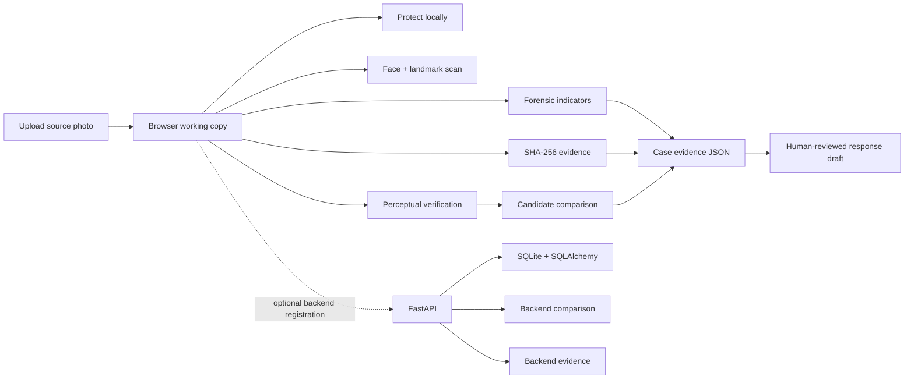
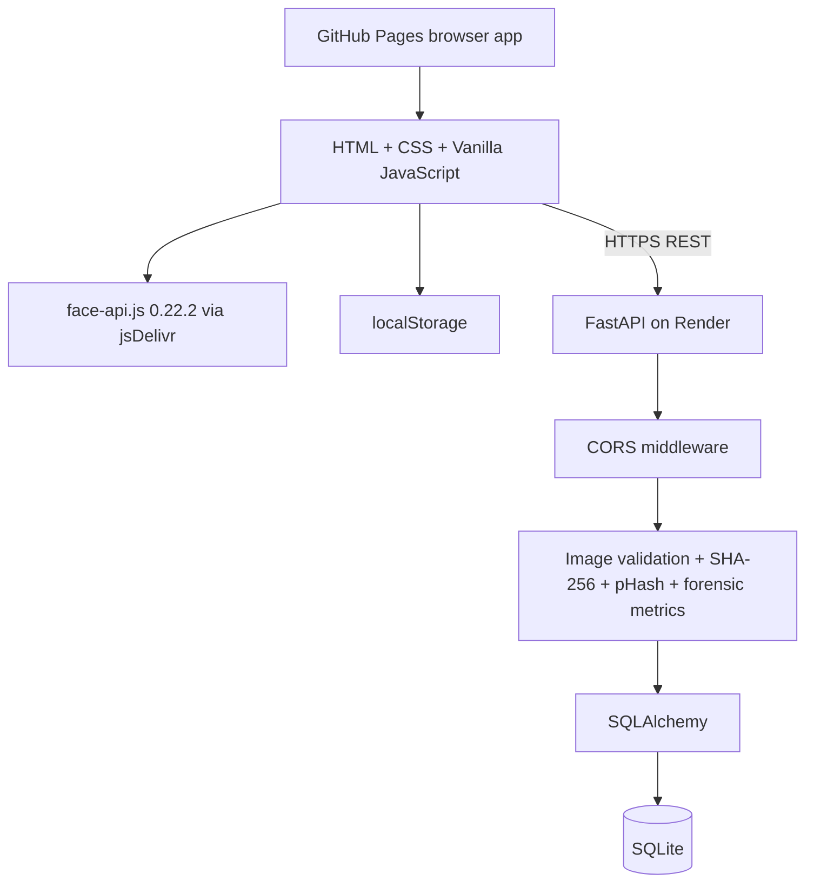
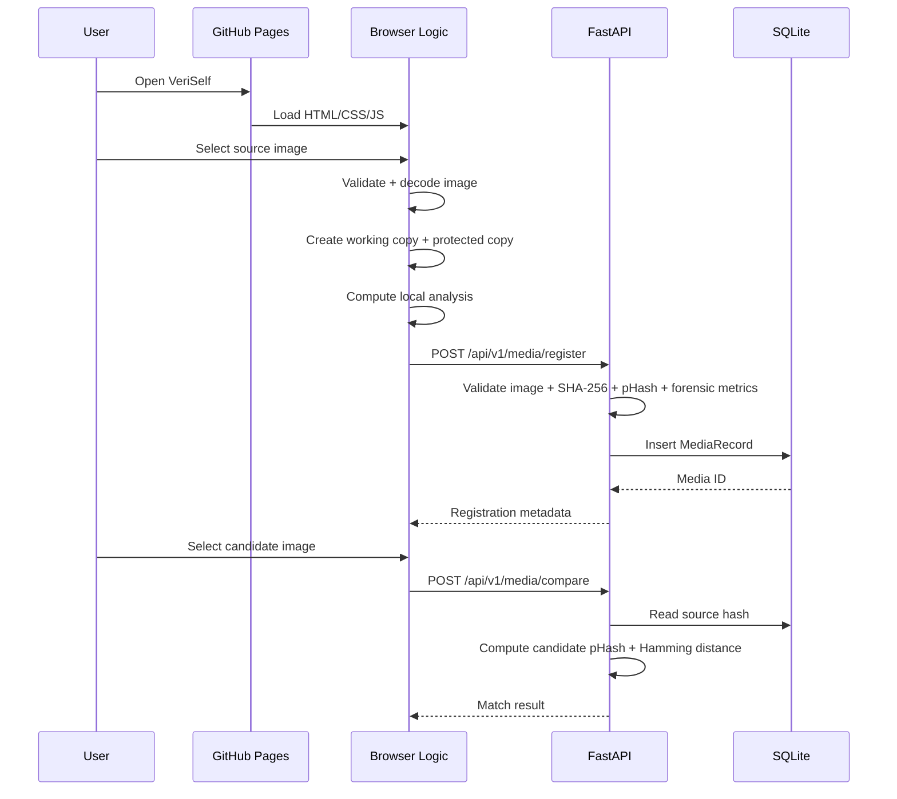
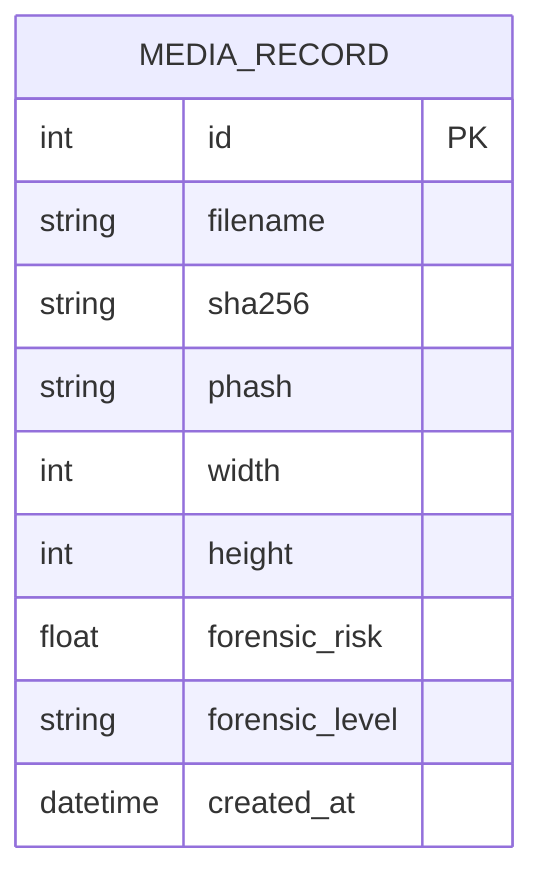

# VeriSelf

[](https://github.com/keke2204/VERISELF/actions/workflows/backend-check.yml)
[](https://github.com/keke2204/VERISELF/actions/workflows/live-integration.yml)
[](https://github.com/keke2204/VERISELF/stargazers)
[](https://github.com/keke2204/VERISELF/network/members)
[](https://github.com/keke2204/VERISELF/issues)
[](apps/backend/requirements.txt)
[](#technology-stack)

> **Protect the face. Verify the media.**

VeriSelf is a browser-first digital identity defense prototype for people whose images circulate online without the infrastructure normally available to high-profile public figures. It combines local photo protection, browser-based face/landmark analysis, perceptual image comparison, forensic indicators, evidence generation, and a human-reviewed response workflow.

The project deliberately separates **what can be measured reproducibly** from claims that would require a validated identity-recognition or deepfake-detection system. Perceptual similarity is treated as similarity, not proof of identity or infringement; forensic metrics are indicators, not a definitive deepfake verdict; and the response workflow produces a draft rather than automatically filing a legal complaint.

---

## Live

| Surface | URL | Purpose |
|---|---|---|
| **Web app** | https://keke2204.github.io/VERISELF/ | Static browser application and interactive demo |
| **API** | https://veriself.onrender.com | FastAPI backend |
| **API health** | https://veriself.onrender.com/api/v1/health | Deployment health endpoint |
| **Repository** | https://github.com/keke2204/VERISELF | Source, CI, deployment configuration |

There is no separate staging application defined in the repository.

---

## Why VeriSelf exists

Digital identity abuse is not limited to celebrities. An ordinary person's face can be copied, altered, reposted, or attached to material they never created. The practical problem is not only detecting suspicious media; it is building a repeatable evidence trail around an image and giving the owner useful next actions.

VeriSelf focuses on a compact, inspectable workflow:

1. **Protect** a source photo locally in the browser.
2. **Scan** the image for a face and 68-point facial landmarks.
3. **Verify** whether another image is perceptually close to the source.
4. **Inspect** simple forensic indicators such as edge variance, channel drift, and texture signal.
5. **Preserve evidence** using the original file's SHA-256 and a perceptual hash.
6. **Prepare a response draft** containing the URL and evidence references for human review.
7. **Optionally register and compare media through the FastAPI backend.**

---

## What the project actually implements

### Photo protection

The browser creates a capped-resolution working copy of the uploaded image and applies a gradient-weighted pixel perturbation. The protected copy can be downloaded as `veriself-protected.png`.

Processing is performed in the browser; the protection operation itself does not require sending the source image to the API.

### Biometric option

The frontend loads `face-api.js` 0.22.2 models from jsDelivr and runs:

- Tiny Face Detector
- 68-point face landmarks
- face bounding box
- detection confidence
- five visual reference markers derived from the 68 landmarks

This is **face detection + landmark analysis**, not identity recognition or face matching against a person database.

### Perceptual verification

The frontend includes a 64-bit Hamming-distance calculator and a second-image comparison workflow. The advanced comparison computes a custom 64-bit DCT-style perceptual hash and classifies:

- `≤ 8 bits` — close perceptual match
- `> 8 bits` — distinct image by this heuristic

The backend implements its own reproducible 64-bit DCT-based perceptual hash and returns the Hamming distance and similarity percentage.

> **Important:** the frontend's simple hash utility and the advanced/backend pHash implementation are separate implementations. A hash value shown by one path should not be assumed to be byte-for-byte identical to the other path.

### Forensic indicators

The advanced frontend computes heuristic indicators from image pixels:

- Laplacian-like variance / edge signal
- RGB channel drift
- texture signal
- a bounded heuristic risk score and LOW/MODERATE/HIGH label

The backend computes corresponding image statistics using Pillow/NumPy.

These values are intentionally presented as **forensic indicators**, not as a validated forensic classifier.

### Evidence package

The browser can generate a JSON evidence object containing:

- generated case identifier
- timestamp
- original filename, MIME type, and byte size
- SHA-256 of the original uploaded file
- perceptual hash
- forensic result, when available
- candidate comparison information, when available

The JSON can be downloaded as `veriself-case-evidence.json`.

The backend also exposes an evidence endpoint for a registered media record.

### Response workflow

The UI can prepare a response/removal-review draft from:

- suspected URL
- identity owner
- SHA-256 evidence value
- pHash value

The draft explicitly states that it is for human review and is **not** an automated legal filing.

---

## Product flow



---

## System architecture



### Request flow



---

## Technology stack

| Layer | Technology | Evidence in repository |
|---|---|---|
| Frontend | HTML5, CSS3, Vanilla JavaScript | `index.html`, `style.css`, `script.js`, `backend-bridge.js` |
| Frontend hosting | GitHub Pages | Live site + repository Pages deployment |
| Face analysis | face-api.js 0.22.2 | CDN script + model URL in `script.js` |
| Backend | FastAPI | `apps/backend/app/main.py` |
| Server | Uvicorn | `apps/backend/requirements.txt`, `render.yaml` |
| Image processing | Pillow | backend requirements + `main.py` |
| Numerical processing | NumPy | backend requirements + `main.py` |
| Database | SQLite | default `DATABASE_URL` + SQLAlchemy model |
| ORM | SQLAlchemy 2.x | `main.py` |
| HTTP client/testing | HTTPX | backend requirements; FastAPI test stack |
| Backend testing | pytest + FastAPI TestClient | `apps/backend/tests/test_api.py` |
| Browser integration testing | Playwright | `.github/live-integration-test.cjs` |
| Backend deployment | Render | `render.yaml` |
| CI/CD | GitHub Actions | `.github/workflows/` |
| Static assets | SVG/PNG | repository root |
| Fonts | Google Fonts | `index.html` |

### State management

There is no React/Redux/Zustand-style state layer. State is managed directly in browser JavaScript through module/global variables and DOM updates.

The frontend persists only selected UI/API settings in `localStorage`, including:

- `veriself-monograph-theme`
- `veriself-api-base`
- `veriself-media-id`

The backend stores registered media metadata in SQLite.

### Authentication and authorization

**Not implemented.**

The API currently has no login, session, token, API-key, user identity, role model, or authorization middleware. The deployed API is therefore a public prototype service rather than a multi-user authenticated production system.

### Monitoring and analytics

No application analytics, APM, error-tracking platform, metrics service, or logging SaaS is configured in the repository.

GitHub Actions provides CI/deployment status, while Render provides deployment/runtime infrastructure.

---

## Frontend feature map

### `01 / Protect Photo`

- JPG, PNG, and WebP file selection
- drag-and-drop upload
- local image decoding
- resolution cap of 720 px on the largest dimension
- gradient-weighted pixel perturbation
- original/protected comparison slider
- protected image download
- reset workflow

### `02 / Biometric Scan`

- Tiny Face Detector
- 68-point landmarks
- detection confidence
- bounding box visualization
- five derived key reference markers
- graceful `MODEL UNAVAILABLE` state when model loading fails

### `03 / Verify Match`

- two 16-character hexadecimal inputs
- 64-bit Hamming distance
- similarity percentage
- close/distinct threshold at 8 bits

### `04 / Forensics + Evidence`

- forensic image check
- second-image pHash comparison
- optional FastAPI registration
- optional FastAPI candidate comparison
- SHA-256 evidence generation
- downloadable case JSON
- human-reviewed response draft

---

## Backend API

Base URL:

```text
https://veriself.onrender.com
```

### `GET /`

Returns the service name, status, and API version.

Example response:

```json
{
  "service": "veriself-backend",
  "status": "ok",
  "version": "1.0.0"
}
```

### `GET /health`
### `GET /api/health`
### `GET /api/v1/health`

Health aliases returning the service state and database technology.

```json
{
  "service": "veriself-backend",
  "status": "healthy",
  "database": "sqlite/sqlalchemy"
}
```

### `GET /api/v1/stats`

Returns the number of registered media records and identifies the storage layer.

```json
{
  "media_records": 0,
  "storage": "local SQLite",
  "biometric": "not performed by backend"
}
```

### `POST /api/v1/media/register`

Multipart upload field:

```text
file=<image>
```

The backend:

1. reads the upload;
2. enforces the 12 MB maximum;
3. validates and decodes the image with Pillow;
4. calculates SHA-256;
5. calculates the backend pHash;
6. calculates heuristic forensic metrics;
7. stores the metadata in SQLite;
8. returns the media ID and analysis metadata.

### `POST /api/v1/media/compare`

Multipart/form fields:

```text
source_id=<registered media ID>
candidate=<image>
```

The backend reads the registered source pHash, calculates the candidate pHash, computes Hamming distance, and returns a percentage based on the 64-bit distance.

### `GET /api/v1/media/{media_id}/evidence`

Returns the stored media metadata, SHA-256, pHash, dimensions, forensic level/risk, timestamp, and explicit limitations.

### `POST /api/v1/enforce/dmca`

Form fields:

```text
url=<suspected media URL>
identity_owner=<owner name>
```

Despite the route name, the implementation **does not dispatch a DMCA complaint**. It generates a review draft and returns `dispatched: false`.

---

## Data model

The backend currently has one SQLAlchemy model: `MediaRecord`.

| Field | Type | Purpose |
|---|---|---|
| `id` | Integer | Primary key |
| `filename` | String(255) | Original upload filename |
| `sha256` | String(64) | Cryptographic digest of uploaded bytes |
| `phash` | String(16) | 64-bit perceptual hash represented as 16 hex characters |
| `width` | Integer | Decoded image width |
| `height` | Integer | Decoded image height |
| `forensic_risk` | Float | Stored heuristic risk score |
| `forensic_level` | String(32) | LOW / MODERATE / HIGH |
| `created_at` | DateTime | UTC record creation time |



There are currently **no user, account, role, session, audit-user, or permission tables**.

---

## Environment variables

The repository defines one application-specific backend environment variable:

| Variable | Required | Default | Used by |
|---|---|---|---|
| `VERISELF_DATABASE_URL` | No | `sqlite:///apps/backend/data/veriself.db` relative to the backend package location | SQLAlchemy database connection |

Render also supplies the platform `PORT` variable used by the deployment command:

```text
uvicorn app.main:app --host 0.0.0.0 --port $PORT
```

The frontend does not require a `.env` file. Its API base can be stored in browser `localStorage` under `veriself-api-base`; otherwise it defaults to `https://veriself.onrender.com`.

---

## Local development

### Prerequisites

- Python 3.12 for the CI-tested backend environment
- A modern browser with Canvas, File APIs, and Web Crypto support
- Git

No frontend package manager or frontend build tool is required for the deployed static site.

### Run the backend

From the repository root:

```bash
cd apps/backend
python -m venv .venv
```

Windows:

```powershell
.venv\Scripts\activate
```

macOS/Linux:

```bash
source .venv/bin/activate
```

Install dependencies:

```bash
python -m pip install -r requirements.txt
```

Start FastAPI:

```bash
uvicorn app.main:app --reload
```

The application exposes FastAPI's generated API documentation through the standard `/docs` route provided by FastAPI.

### Run backend tests

From `apps/backend`:

```bash
pytest -q
```

The repository CI also compiles the backend and imports the application before running the tests.

### Run the static frontend locally

The frontend is a static HTML/CSS/JavaScript application. It can be served from the repository root with any static HTTP server. No frontend build command is defined in the repository.

For example, with Python:

```bash
python -m http.server 8000
```

Then open the directory containing `index.html` through the local HTTP server.

For browser APIs, model loading, and file handling, use an HTTP server rather than opening the HTML file directly with `file://`.

---

## Deployment

### GitHub Pages

The production frontend is the static application served at:

```text
https://keke2204.github.io/VERISELF/
```

The repository contains the production static assets at its root:

```text
index.html
style.css
script.js
backend-bridge.js
logo.svg
original.png
cloaked.png
architecture.svg
watermarked.png
```

GitHub Pages deployment is separate from the FastAPI service.

### Render

`render.yaml` defines the backend deployment:

```yaml
services:
  - type: web
    name: veriself-api
    runtime: python
    rootDir: apps/backend
    buildCommand: pip install -r requirements.txt
    startCommand: uvicorn app.main:app --host 0.0.0.0 --port $PORT
    healthCheckPath: /api/v1/health
    autoDeploy: true
```

The backend therefore deploys from `apps/backend`, not from the frontend root.

---

## CI/CD

The repository has three project-specific GitHub Actions workflows.

### Backend Check

`.github/workflows/backend-check.yml`

Runs when backend files or the workflow change. It:

1. checks out the repository;
2. installs Python 3.12;
3. installs backend dependencies;
4. compiles Python files;
5. imports the FastAPI application;
6. runs pytest.

### Live Browser Integration

`.github/workflows/live-integration.yml`

Runs against the deployed GitHub Pages application and Render API. It installs Playwright/Chromium and tests the real browser path, including the visible Protect Photo file picker, source upload, backend registration, candidate upload, and backend comparison.

The integration test currently validates a small in-memory PNG fixture and expects the source/candidate comparison to produce a zero-bit Hamming distance and a close perceptual match.

### Updated ZIP packaging

`.github/workflows/build-updated-zip.yml`

Rebuilds `VeriSelf-UPDATED.zip` by taking the repository's bundled project archive and replacing its GitHub Pages files with the current root frontend files. The generated ZIP is uploaded as a GitHub Actions artifact for seven days.

> The packaging workflow is a distribution convenience; it is not the deployment mechanism for the Render API.

---

## Security model

VeriSelf currently uses several concrete safeguards, while intentionally remaining a prototype rather than an authenticated production service.

### Implemented safeguards

- Image MIME/extension validation in the browser.
- Empty-file validation in the browser.
- Read/decode validation before processing.
- Backend image decoding with Pillow.
- Backend 12 MB upload limit.
- Real SHA-256 calculation over uploaded bytes.
- Browser-side evidence hashing through Web Crypto.
- CORS middleware on the API.
- No automatic legal dispatch.
- No backend claim of identity recognition.
- Explicit limitation language for heuristic forensics and perceptual matching.

### Current security boundaries

Authentication and authorization are not implemented. The backend CORS policy currently allows all origins, and the API does not require credentials. SQLite is used as the default persistence layer.

Consequently, the current deployment should be treated as a **public technical prototype/demo**, not as a hardened multi-tenant identity-defense service for sensitive production data.

For a production security program, the repository would need at minimum an authenticated identity layer, authorization boundaries, persistent production-grade storage, abuse/rate controls, stricter origin policy, operational logging, secrets management, and a formal privacy/data-retention design.

---

## Privacy model

The strongest privacy property in the current frontend is that the photo-protection and browser biometric workflows operate on browser-side image data.

The optional backend workflow is different: when the user registers a source or compares a candidate, the selected images are uploaded to the FastAPI service. The backend stores **metadata and hashes**, not an image file, in its SQLite `MediaRecord` table.

The current code does not implement an account-level retention/deletion policy, so users should not interpret the prototype as a complete privacy-management system.

---

## Performance characteristics

The project uses several lightweight constraints to keep the browser demo responsive:

- uploaded working images are capped at 720 px on the largest dimension;
- the browser protection algorithm operates on the capped canvas;
- face models are loaded lazily when the biometric scan is requested;
- the face-api model promise is cached so repeated scans do not start duplicate model loads;
- the backend uses compact 64-bit perceptual hashes instead of storing image embeddings;
- the backend performs image validation before database insertion;
- the API stores metadata/hashes rather than image blobs in `MediaRecord`.

The custom JavaScript DCT-style pHash and Python DCT implementation are intentionally straightforward and reproducible rather than optimized for large-scale batch processing.

---

## Third-party integrations

### face-api.js / jsDelivr

The frontend loads `face-api.js` 0.22.2 from jsDelivr and retrieves its Tiny Face Detector and 68-point landmark model weights from the pinned 0.22.2 weight path.

### Google Fonts

The UI requests the `Newsreader` and `Space Mono` font families from Google Fonts.

### GitHub Pages

Hosts the static frontend.

### Render

Hosts the FastAPI backend defined by `render.yaml`.

No payment provider, analytics SDK, social login, email provider, cloud object store, or external image-search API is configured in the current codebase.

---

## Repository structure

```text
VERISELF/
├── .github/
│   ├── live-integration-test.cjs
│   └── workflows/
│       ├── backend-check.yml
│       ├── build-updated-zip.yml
│       └── live-integration.yml
│
├── apps/
│   └── backend/
│       ├── app/
│       │   ├── __init__.py
│       │   └── main.py
│       ├── tests/
│       │   └── test_api.py
│       ├── requirements.txt
│       └── README.md
│
├── index.html
├── script.js
├── backend-bridge.js
├── style.css
├── logo.svg
├── original.png
├── cloaked.png
├── architecture.svg
├── watermarked.png
├── render.yaml
└── veriself-full-project-updated.zip
```

### Source-of-truth boundaries

- **Frontend source of truth:** root `index.html`, `style.css`, `script.js`, and `backend-bridge.js`.
- **Backend source of truth:** `apps/backend/app/main.py`.
- **Backend tests:** `apps/backend/tests/test_api.py`.
- **Deployment definition:** `render.yaml`.
- **CI definitions:** `.github/workflows/`.
- **Packaged ZIP:** generated distribution artifact, not the canonical backend source.

---

## Testing strategy

### Backend unit/API tests

The current suite covers:

- health endpoint;
- media registration;
- SHA-256 output shape;
- pHash output shape;
- exact-image comparison with zero Hamming distance;
- evidence retrieval;
- invalid-image rejection;
- draft-only response workflow.

### Live browser integration

The live integration suite verifies the deployed browser-to-backend path rather than only calling the API directly. It exercises the visible Protect Photo picker, file input, backend registration, candidate input, and rendered comparison result.

The test intentionally uses a tiny PNG fixture for deterministic integration behavior; it is not a substitute for a full computer-vision evaluation suite.

---

## Design principles

### 1. Evidence over claims

Every high-level result is tied to an observable computation: hashes, distances, image statistics, or model output.

### 2. Local-first processing

The most privacy-sensitive demo operation — creating the protected image and running the browser biometric scan — is implemented client-side.

### 3. Explicit limitations

The application avoids presenting perceptual similarity as identity proof, heuristic forensics as a deepfake verdict, or a response draft as an automatically filed legal action.

### 4. Small, inspectable primitives

The core image operations are intentionally readable JavaScript/Python rather than hidden behind a large opaque processing service.

### 5. Independent frontend/backend responsibilities

The static site remains usable as a browser demo, while the FastAPI service provides optional registration, comparison, and evidence persistence.

---

## Known scope boundaries

VeriSelf currently does **not** implement:

- user accounts;
- authentication;
- authorization or RBAC;
- identity recognition against a person database;
- a validated deepfake classifier;
- automated public-web crawling or monitoring;
- automatic takedown/DMCA submission;
- automatic legal decision-making;
- image-object storage in the backend;
- production-grade multi-tenant data isolation;
- application analytics/APM;
- a frontend build system;
- a production database migration framework.

These boundaries are intentional in the current implementation and are preferable to presenting unimplemented concepts as finished features.

---

## Contributing

Contributions are welcome when they preserve the project's evidence-first and limitation-aware design.

### Before opening a pull request

Run the backend test suite:

```bash
cd apps/backend
pytest -q
```

For frontend changes, verify the affected browser interaction through the deployed integration workflow or an equivalent browser test. Changes that alter an API contract should update `apps/backend/tests/test_api.py` and the API documentation in this README.

### Good contribution areas

- stronger automated browser coverage;
- accessibility improvements;
- deterministic image-processing tests;
- API schema validation;
- production-grade authentication/authorization design;
- privacy and retention controls;
- database migration support;
- performance improvements with reproducible benchmarks;
- better forensic evaluation backed by validated datasets and metrics.

### Pull request expectations

- Explain the user-visible or architectural change.
- Include tests for behavior changes.
- Do not describe heuristic results as definitive forensic conclusions.
- Do not add credentials, secrets, or private media to the repository.
- Keep the frontend/backend boundary explicit.

---

## Roadmap direction

The repository itself does not currently define a formal roadmap file or issue milestone plan. Based on the implemented architecture, future work can naturally build toward:

- authenticated user ownership of evidence;
- durable production database storage;
- explicit media retention/deletion controls;
- stricter API origin and abuse controls;
- real web-monitoring integrations with clear terms-of-service boundaries;
- validated forensic models with documented datasets and metrics;
- stronger end-to-end browser regression coverage;
- versioned API schemas and migrations.

These are **future engineering directions**, not current features.

---

## License

No `LICENSE` file is present in the repository at the time this README was generated. The project therefore does not declare an open-source license in the repository itself.

If this repository is intended to accept public contributions or redistribution, add an explicit license before representing it as formally open-source.

---

## Maintainer

**ASK Team**

Project repository: https://github.com/keke2204/VERISELF

---

## Screenshots

The repository currently does not contain a dedicated screenshot gallery. For a polished project landing page, the most useful screenshots would be:

1. **Landing / Hero** — the editorial landing page with the three-step workflow.
2. **Protect Photo** — upload area plus original/protected comparison slider after processing.
3. **Biometric Scan** — detected face, bounding box, confidence, and landmark references.
4. **Verify Match** — pHash/Hamming comparison with a close-match and distinct-image example.
5. **Forensics + Evidence** — forensic indicators, evidence package, and response-draft workflow.
6. **Mobile layout** — the same core workflow at a narrow viewport.

Recommended repository location if screenshots are added later:

```text
docs/
└── screenshots/
    ├── landing.png
    ├── protect-photo.png
    ├── biometric-scan.png
    ├── verify-match.png
    ├── evidence.png
    └── mobile.png
```

---

## Final note

VeriSelf is strongest when treated as an **auditable digital-identity defense prototype**: it makes concrete image measurements, keeps the most sensitive demo processing in the browser, preserves cryptographic evidence, and clearly separates measurable signals from claims that require stronger models or human/legal review.

That distinction is part of the architecture — not just documentation.